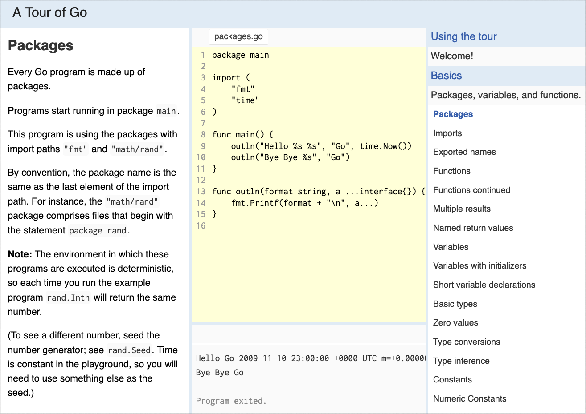
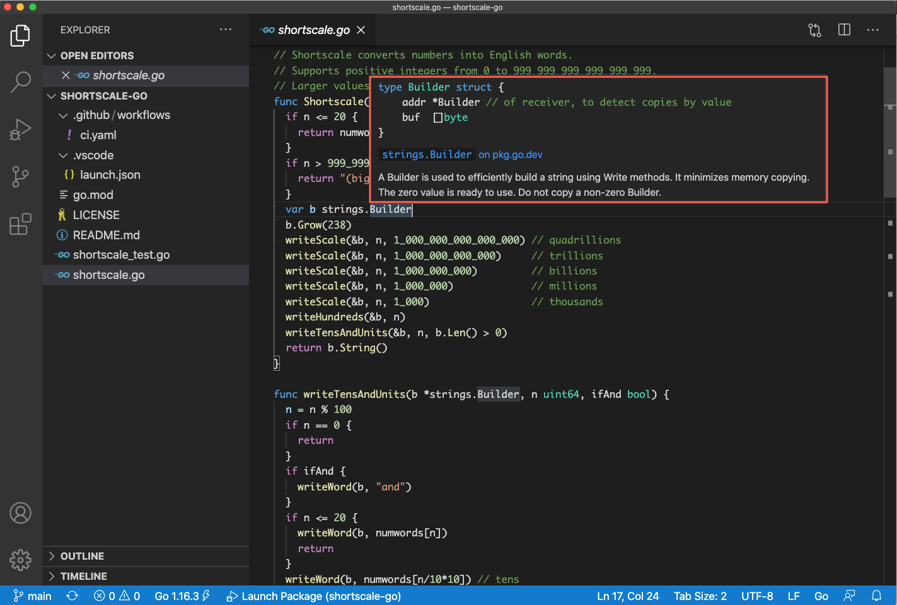

## Golang

The [Go](https://go.dev/) programming language has become an important tool for developers, particularly around platforms like Kubernetes and Docker.

Go was created at Google by a team whose roots go back to Bell Labs and [C](https://en.wikipedia.org/wiki/C_(programming_language)). Their [motivations](https://talks.golang.org/2012/splash.article) included fast compilation time, and productive development of large scale distributed systems, handling high volumes of concurrent requests.

This article describes my experience as a new user of Go, building my first Go library. It follows a learning pattern similar to [forays from Node to Rust](/blog/forays-from-node-to-rust).

## Getting started

The [Tour of Go](https://tour.golang.org/basics/1) is a great way to get familiar with the language syntax. I started with 'hello world' at [golang.org](https://golang.org/doc/tutorial/getting-started#install), and found myself going back to the tour for different topics.

[](https://tour.golang.org/basics/1)

The macOS [installer](https://golang.org/doc/manage-install) copies everything into `/usr/local/go`, so I opted to download the latest release from https://golang.org/dl/ into a versioned [$GOROOT](https://golang.org/doc/install/source#environment) under my home directory. Here's what I have in my '.bash_profile':

```sh
export GOPATH=~/go
export GOROOT=~/go1.16.3
export PATH=${PATH}:${GOROOT}/bin:${GOPATH}/bin
```

## VS Code

The [VS Code Go](https://github.com/golang/vscode-go/) extension has improved a lot over the years. It now auto-installs the [delve](https://github.com/go-delve/delve) debugger, and the [gopls](https://blog.golang.org/gopls-vscode-go) language server. I did not have to do any additional configuration.

Hovering over types like `Builder` shows source docs, and links to [pkg.go.dev](https://go.dev).



## Porting from Rust to Go

I found it quite easy to port [shortscale-rs](https://github.com/jldec/shortscale-rs/blob/main/src/shortscale.rs#L15) to [shortscale-go](https://github.com/jldec/shortscale-go/blob/main/shortscale.go).

Go has no ownership syntax, and the run-time includes a garbage collector.

In this case, I was also lucky that the Go [strings.Builder](https://pkg.go.dev/strings#Builder) standard library package is very similar to the [writer](https://github.com/jldec/shortscale-rs/blob/main/src/shortscale.rs#L46) pattern I ended up using for Rust.

> Overall, I was pleasantly surprised with the readability of the code

```go
package shortscale

import (
  "strings"
)

// Shortscale converts numbers into English words.
// Supports positive integers from 0 to 999_999_999_999_999_999.
// Larger values return "(big number)".
func Shortscale(n uint64) string {
  if n <= 20 {
    return numwords[n]
  }
  if n > 999_999_999_999_999_999 {
    return "(big number)"
  }
  b := new(strings.Builder)
  writeScale(b, n, 1_000_000_000_000_000) // quadrillions
  writeScale(b, n, 1_000_000_000_000)     // trillions
  writeScale(b, n, 1_000_000_000)         // billions
  writeScale(b, n, 1_000_000)             // millions
  writeScale(b, n, 1_000)                 // thousands
  writeHundreds(b, n)
  writeTensAndUnits(b, n, b.Len() > 0)
  return b.String()
}

func writeTensAndUnits(b *strings.Builder, n uint64, ifAnd bool) {
  n = n % 100
  if n == 0 {
    return
  }
  if ifAnd {
    writeWord(b, "and")
  }
  if n <= 20 {
    writeWord(b, numwords[n])
    return
  }
  writeWord(b, numwords[n/10*10]) // tens
  units := n % 10
  if units > 0 {
    writeWord(b, numwords[units])
  }
}

func writeHundreds(b *strings.Builder, n uint64) {
  n = n / 100 % 10
  if n == 0 {
    return
  }
  writeWord(b, numwords[n])
  writeWord(b, numwords[100])
}

func writeScale(b *strings.Builder, n uint64, thousands uint64) {
  n = n / thousands % 1_000
  if n == 0 {
    return
  }
  writeHundreds(b, n)
  writeTensAndUnits(b, n, (n/100%10) > 0)
  writeWord(b, numwords[thousands])
}

func writeWord(b *strings.Builder, word string) {
  if b.Len() > 0 {
    b.WriteString(" ")
  }
  b.WriteString(word)
}

var numwords = map[uint64]string{
  0:                     "zero",
  1:                     "one",
  2:                     "two",
  3:                     "three",
  4:                     "four",
  5:                     "five",
  6:                     "six",
  7:                     "seven",
  8:                     "eight",
  9:                     "nine",
  10:                    "ten",
  11:                    "eleven",
  12:                    "twelve",
  13:                    "thirteen",
  14:                    "fourteen",
  15:                    "fifteen",
  16:                    "sixteen",
  17:                    "seventeen",
  18:                    "eighteen",
  19:                    "nineteen",
  20:                    "twenty",
  30:                    "thirty",
  40:                    "forty",
  50:                    "fifty",
  60:                    "sixty",
  70:                    "seventy",
  80:                    "eighty",
  90:                    "ninety",
  100:                   "hundred",
  1_000:                 "thousand",
  1_000_000:             "million",
  1_000_000_000:         "billion",
  1_000_000_000_000:     "trillion",
  1_000_000_000_000_000: "quadrillion",
}
```

## Tests and benchmarks

The [testing](https://pkg.go.dev/testing) package provides support for running tests and benchmarks with `go test`. The GitHub Action [workflow](https://github.com/jldec/shortscale-go/blob/main/.github/workflows/ci.yaml#L25) for shortscale-go make use of this.

Out of curiosity, I ran [BenchmarkShortscale](https://github.com/jldec/shortscale-go/blob/main/shortscale_test.go#L24) for two variants of the Shortscale function, one which [pre-allocates](https://github.com/jldec/shortscale-go/blob/358a49f24dcb9d4b2c697233f37f5dea4c87d318/shortscale.go#L18) memory for string.Builder, and one which does not. Pre-allocating, reduced the number of allocs/op from 4 to 1, improving ns/op by about 85ns.

**Pre-allocated**
```
$ go test -bench . -benchmem
goos: darwin
goarch: amd64
pkg: github.com/jldec/shortscale-go
cpu: Intel(R) Core(TM) i7-9750H CPU @ 2.60GHz

5694252	       205.5 ns/op	      64 B/op	       1 allocs/op
```

**Not pre-allocated**
```
$ go test -bench . -benchmem
goos: darwin
goarch: amd64
pkg: github.com/jldec/shortscale-go
cpu: Intel(R) Core(TM) i7-9750H CPU @ 2.60GHz

4100697	       292.9 ns/op	     120 B/op	       4 allocs/op
```


## Dependency management

Until quite recently, Go [did not have](https://research.swtch.com/vgo-intro#versioning_and_api_stability) built-in package versioning like [npm](/blog/migrating-from-cjs-to-esm) or [cargo](/blog/forays-from-node-to-rust). This led to incompatibile versioning add-ons, like [godep](https://github.com/tools/godep) and [glide](https://github.com/Masterminds/glide), which made packages with nested dependencies difficult to consume. E.g. see this old [INSTALL.md](https://github.com/kubernetes/client-go/blob/416948da08dfd61cd4a08a3d679865ce91ff39b6/INSTALL.md#dependency-management-for-the-serious-or-reluctant-user) from kubernetes/client-go.

> Fortunately, [Go modules](https://blog.golang.org/using-go-modules) are enabled as the default in Go since [v1.16](https://blog.golang.org/go116-module-changes).

## go.mod

I created my [shortscale-go](https://github.com/jldec/shortscale-go/blob/main/go.mod) module with [go mod init](https://golang.org/pkg/cmd/go/#hdr-Module_maintenance) following the guide in [Using Go Modules](https://blog.golang.org/using-go-modules).

```sh
$ go mod init github.com/jldec/shortscale-go
go: creating new go.mod: module github.com/jldec/shortscale-go
```
This created a new **go.mod** file with the following content.

```js
module github.com/jldec/shortscale-go

go 1.16
```

I was a little surprised that there was no way to indicate the module version inside `go.mod`. Go [relies on git tags](https://blog.golang.org/publishing-go-modules) in the form vx.x.x for this. As I pushed each version to GitHub, I used the GitHub [Releases](https://github.com/jldec/shortscale-go/releases) UI to create the tag.

## pkg.go.dev

The shortscale package is published at https://pkg.go.dev/github.com/jldec/shortscale-go

[](https://pkg.go.dev/github.com/jldec/shortscale-go)

It turns out that fetching any versioned module with `go get`, automatically adds that module to the registry at [go.dev](https://go.dev/about). This feels a little strange at first, but the more I use it, the more I think it's a clever solution.

> How about using a similar scheme to create a vendor-neutral registry for [ESM modules](/blog/extracting-an-esm-module-from-a-deno-script)?  
🤔

_To leave a comment  
please visit [dev.to/jldec](https://dev.to/jldec/getting-started-with-go-2m9e)_


