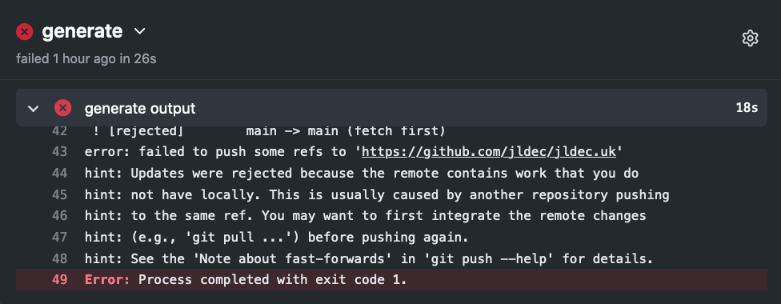

## GitHub Actions Workflows

What happens when you trigger a [GitHub Actions](/github-actions-101) workflow which is already running? Workflows which depend on being run one-at-a-time might fail.

I recently encountered this with a [workflow](https://github.com/jldec/cloudflare-pages-test/blob/main/.github/workflows/generate.yaml) for publishing a static website. This workflow generates HTML files which are pushed to another git repo for publishing by [GitHub Pages](https://pages.github.com/).

When two workflows try to push to a checked-out repo at the same time, one will fail because it is missing the last commit from the other.

 This is just one example where concurrent workflows are problematic. Workflows which [automate](https://github.community/t/serializing-workflow-runs-in-the-context-of-continuous-deployment/17559) [deployments](https://github.community/t/how-to-limit-concurrent-workflow-runs/16844) have the same [problem](https://github.community/t/serializing-queueing-deployment-workflows-aws-re-invent/17152).

A number of 3rd party [solutions](https://github.com/softprops/turnstyle) exist, but these introduce additional waiting costs or other issues. For one of my projects, I host a lock-service, just to force concurrent workflows to exit quietly, and then auto-trigger re-runs.

> Finally, on April 19, 2021,  
[this](https://github.blog/changelog/2021-04-19-github-actions-limit-workflow-run-or-job-concurrency/) appeared in the GitHub Blog.

In the case of using actions to generate a GitHub Pages website, [the feature works](https://docs.github.com/en/actions/reference/workflow-syntax-for-github-actions#concurrency) exactly as required.

- The first workflow will run to completion.
- Subsequent concurrent workflows will either be delayed or cancelled.
- In the end only the first and last of the overlapping workflows will be run.

And all you need is [2 lines of yaml](https://github.com/jldec/cloudflare-pages-test/blob/main/.github/workflows/generate.yaml#L5-L6).
This is from the workflow which generates [jldec.uk](https://jldec.me/first-steps-using-cloudflare-pages#github-pages).

The `group` can be any string - workflows in the same group are effectively serialized.

> Thank you GitHub!

