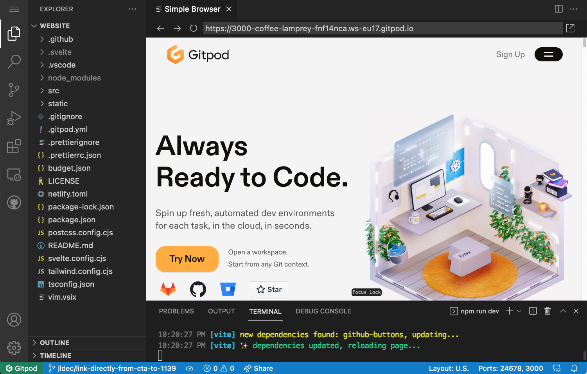

## Gitpod Workspaces

[Gitpod](https://www.gitpod.io/) hosts **workspaces** for developers.

Think of each [workspace](https://www.gitpod.io/docs#your-computer-in-the-cloud) as your own Linux container in the cloud, with a fully functional development environment, including:

- A clone of your git repo and your git working tree - the files you're working on.
- The tools you need while coding - compilers, SDKs, runtimes.
- Your editor - the default is [VS Code](https://www.gitpod.io/blog/openvscode-server-launch) + extensions - reachable through a browser.
- Shell access to run commands in the container.

Instead of laboriously maintaining your local development environment with everything you need, you simply open a new workspace every time you start working on a new project or branch.

## PR for the Gitpod website 

Here's how I created a PR for the [Gitpod website](https://www.gitpod.io/) in just a few minutes.

Starting from the [issue](https://github.com/gitpod-io/website/issues/1139), I opened a new workspace in Gitpod by prefixing the GitHub url like so: `https://gitpod.io/#https://github.com/gitpod-io/website/issues/1139`. 

That [url](https://gitpod.io/#https://github.com/gitpod-io/website/issues/1139) opened the workspace in my browser.

Running `git branch -vv` in a workspace terminal showed that git was already set to a new branch, conveniently named with my username and the description and id of the GitHub issue.

The workspace started up with npm modules already installed by a [prebuild](https://www.gitpod.io/docs/prebuilds).

The repo was also [configured](https://www.gitpod.io/docs/config-gitpod-file) to start a dev server listening on port 3000 in the workspace container. The open ports can be seen in the Remote Explorer sidebar on the left.

I used the `Open Browser` icon to open the website in another browser window, and watched my changes taking effect each time I modified the code. 

Finally, I pushed a commit with my changes on the new branch to GitHub, and proceeded to create my PR as usual. No localhost interaction other than running my browser was required.

> This blogpost was written from a Gitpod workspace.  
> 🚀 

_To leave a comment  
please visit [dev.to/jldec](https://dev.to/jldec/using-gitpod-to-create-a-pr-3cba)_
